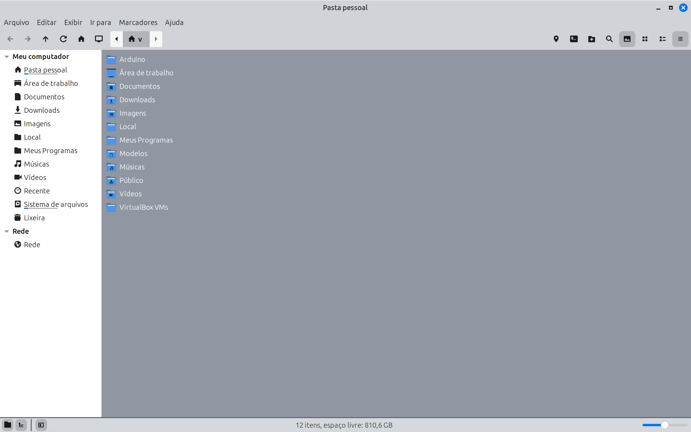

#Linux Mint Theme - Mint-Y-Off-White
   A flat off-white theme featuring transparent elements.

#Examples

#Installation Instructions

  Copy this project to your themes folder, typically located at: /usr/share/themes/
  Navigate to: Start Menu -> Settings -> Themes and select Workspace -> Mint-Y-Off-White.
  
  Recommended combinations:
  
  Applications:   Mint-Y-Off-White
  
  Icons:          Papirus
